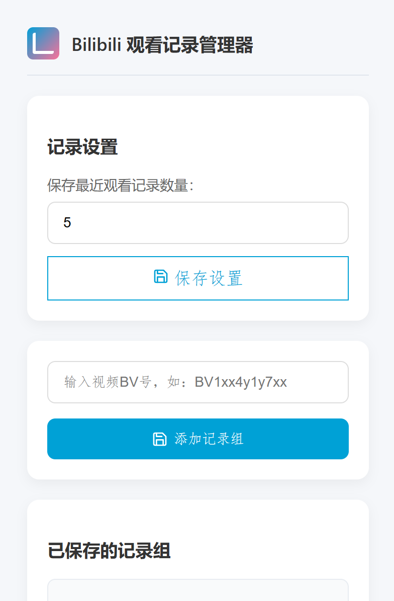

# Bilibili 观看记录管理器 - Chrome 扩展

## ✨ 概述
这是一个用于管理Bilibili视频观看记录的Chrome扩展，可帮助用户：
- 创建视频记录组并自动记录观看历史
- 保存多个视频的播放进度和时间戳
- 自定义每个视频保存的最近观看记录数量

### 说明
特殊合集：
- 视频为同一BV号下不同分P，例如[https://www.bilibili.com/video/BV1ps4y1d73V/?p=61](https://www.bilibili.com/video/BV1ps4y1d73V/?spm_id_from=333.788.videopod.sections&vd_source=149d3dc03b60b6fd7822edc452305a7c&p=61) 中p=61为第61个视频
- 可以看作二次聚合

一般合集：
- 一般的合集各个视频有不同的BV号

### 扩展界面预览

## 🚀 功能亮点
1. **记录组管理**
   - 拖拽排序记录组（拖动左侧 :::icon{draggable} 图标）
   - 展开/折叠查看详细记录
   - 删除不需要的记录组

2. **智能观看记录**
   - 自动跟踪视频播放进度（30秒节流采样）
   - 保存观看时间、进度百分比和具体时间点
   - 点击记录直接跳转到对应视频位置

3. **自定义设置**
   - 设置每个视频保存的记录数量（1-50条）
   - 自动裁剪超出数量的历史记录

4. **数据持久化**
   - 使用Chrome同步存储保存所有数据
   - 支持跨设备同步（需登录Chrome账号）

## 🔧 安装步骤
1. 克隆仓库或下载ZIP文件，解压zip文件
2. 在Chrome中加载扩展：
- 访问 Chrome 管理控制程序 (chrome://extensions/)
- 启用"开发者模式"
- 点击"加载已解压的扩展程序"，选择项目目录
- 或直接拖动加压后文件夹到 chrome://extensions/ 页面

3. 在Bilibili视频页面中，扩展会自动激活

## 📖 使用指南
1. **添加视频记录组**
- 点击扩展图标打开弹出窗口
- 输入视频BV号（如`BV1xx4y1y7xx`）
- 点击"添加记录组"按钮

2. **查看观看记录**
- 记录组按添加顺序排列
- 点击"展开"查看详细观看历史
- 记录包含：
  - 视频名称（可点击跳转）
  - 观看日期和时间
  - 进度条（百分比可视化）

3. **管理记录组**
- 拖拽左侧 :::icon{draggable} 图标调整顺序
- 点击"删除"移除整个记录组
- 使用"收起"按钮压缩显示空间

4. **配置设置**
- 在"记录设置"区域调整保存数量
- 输入1-50之间的数字
- 点击"保存设置"应用变更

## ⚠️ 注意事项
1. 内容脚本仅在bilibili.com域名下激活
2. 同步存储上限约100KB（建议保持记录组<20个）
3. 数据通过Chrome账户同步（需登录）

## 🤝 贡献指南
欢迎提交PR改进以下方面：
- 添加批量导入/导出功能
- 实现分类标签系统

**许可证**：MIT
